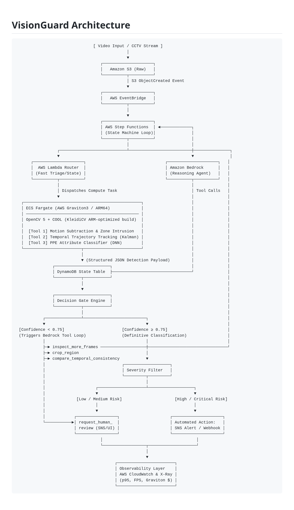

# VisionGuard: Agentic Video Safety & Incident Response

> Built for the **OpenCV AI Competition 2026**  
> Tracks: **Agentic Vision** & **Best Use of COOL**

VisionGuard transforms passive CCTV feeds into verified safety actions. By coupling **OpenCV 5 accelerated via COOL (Cloud-Optimized OpenCV Library)** on **AWS Graviton3** with an **Amazon Bedrock (Claude 3.5 Sonnet)** agentic reasoning loop, VisionGuard eliminates false alarms and ensures auditable human-in-the-loop escalation for workplace hazard zones.

---

## Architecture Overview

VisionGuard separates fast edge routing from heavy multi-frame analysis and LLM orchestration:



---

## 1. Quickstart & One-Command Deployment

### Prerequisites
* AWS CLI configured (`AdministratorAccess` or scoped equivalent)
* Docker with Multi-Arch Buildx support
* Python 3.12+ and AWS CDK v2 (`npm install -g aws-cdk`)

### Step 1: Deploy Infrastructure
Deploy the S3 buckets, DynamoDB state table, Step Functions ASL, and ECS Graviton cluster in one command:

```bash
git clone [https://github.com/your-team/visionguard.git](https://github.com/your-team/visionguard.git)
cd visionguard

# Deploy entire infrastructure stack
cdk deploy --require-approval never
